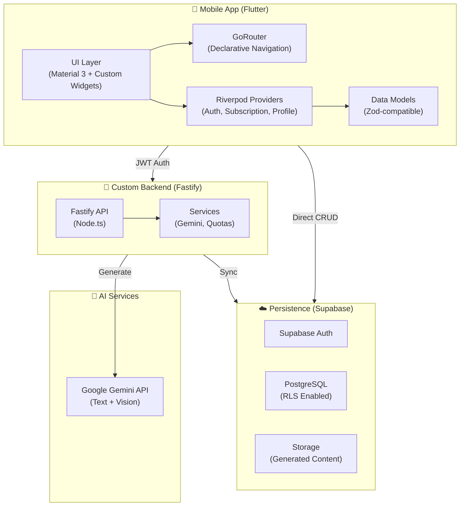

# Kidivity — System Architecture

## High-Level Architecture



---

## Directory Structure

```
kidivity/
├── docs/                          ← Documentation
├── app/                           ← Flutter Mobile App
│   ├── lib/
│   │   ├── core/                  ← Shared logic
│   │   │   ├── providers/         ← Riverpod state
│   │   │   ├── theme/             ← Styling & Theme
│   │   │   ├── models/            ← Data classes
│   │   │   └── components/        ← Core UI library
│   │   ├── features/              ← Feature-based screens
│   │   │   ├── home/
│   │   │   ├── generate/
│   │   │   ├── activities/
│   │   │   ├── profile/
│   │   │   ├── settings/
│   │   │   ├── auth/
│   │   │   └── subscription/
│   │   ├── router/                ← GoRouter setup
│   │   └── main.dart              ← Entry point
├── server/                        ← Fastify Backend
│   ├── src/
│   │   ├── routes/                ← API Endpoints
│   │   ├── services/              ← Business logic (AI, Quota)
│   │   ├── plugins/               ← Fastify plugins (Auth, Cors)
│   │   └── index.ts               ← Server entry
└── supabase/                      ← Database Migrations & Config
```

---

## Key Architecture Decisions

| Decision | Choice | Rationale |
| :--- | :--- | :--- |
| **Framework** | **Flutter** | Native performance and pixel-perfect UI control for educational content. |
| **State management** | **Riverpod** | Highly reactive, compile-safe, and independent of the widget tree. |
| **Backend** | **Fastify** | Custom server allows for complex AI prompt logic and specialized rate limiting. |
| **Auth** | **Supabase Auth** | Industry standard JWT-based auth with social and anonymous support. |
| **Billing** | **RevenueCat** | Simplifies cross-platform subscriptions and entitlement management. |

---

## Security Model

1. **API Keys** — Google Gemini keys are never stored on the client. They reside in the Fastify environment.
2. **Row Level Security** — Database access is guarded by RLS. Users can only read/write their own profiles.
3. **JWT Validation** — The backend validates the Supabase JWT on every request to ensure the user is who they say they are.
4. **Rate Limiting** — Enforced at the server level to prevent AI cost overruns.
