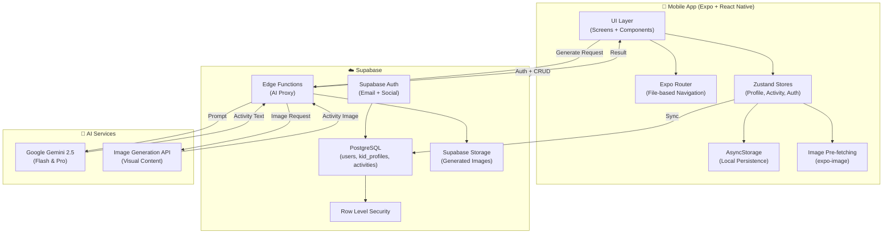
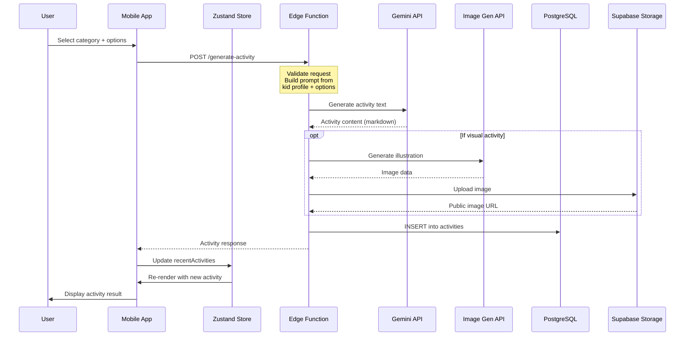

# Kaivity — System Architecture

## High-Level Architecture



---

## Directory Structure

```
kaivity/
├── docs/                          ← Project documentation
│   ├── project_requirements.md
│   ├── screen_flow.md
│   ├── data_model.md
│   ├── api_design.md
│   └── architecture.md           ← This file
│
├── Kaivity/                      ← Expo mobile app
│   ├── app/                       ← File-based routing (screens)
│   │   ├── (auth)/                ← Auth screens (welcome, sign-up)
│   │   ├── (onboarding)/          ← First-time profile creation
│   │   ├── (tabs)/                ← Main tab navigator
│   │   │   ├── _layout.tsx        ← Tab bar configuration
│   │   │   ├── index.tsx          ← Home / Dashboard
│   │   │   ├── generate.tsx       ← Activity Generator
│   │   │   ├── saved.tsx          ← Saved Activities
│   │   │   └── settings.tsx       ← Settings & Profiles
│   │   ├── activity/              ← Activity detail routes
│   │   ├── profile/               ← Profile CRUD routes
│   │   ├── _layout.tsx            ← Root stack navigator
│   │   └── print-preview.tsx      ← Print modal
│   │
│   ├── components/                ← Reusable UI components
│   │   ├── ui/                    ← Primitives (Button, Card, Input, etc.)
│   │   ├── activity/              ← Activity-specific components
│   │   ├── profile/               ← Profile-specific components
│   │   └── common/                ← Shared (Header, EmptyState, etc.)
│   │
│   ├── store/                     ← Zustand state management
│   │   ├── authStore.ts
│   │   ├── profileStore.ts
│   │   └── activityStore.ts
│   │
│   ├── lib/                       ← Utilities & clients
│   │   ├── supabase.ts            ← Lazy-init Supabase client (Proxy)
│   │   ├── api.ts                 ← Edge Function API calls
│   │   └── utils.ts               ← Shared helpers
│   │
│   ├── constants/                 ← App constants
│   │   ├── theme.ts               ← Colors, fonts, spacing, shadows
│   │   ├── categories.ts          ← Activity category definitions
│   │   ├── grades.ts              ← Grade level enum
│   │
│   ├── types/                     ← TypeScript type definitions
│   │   ├── profile.ts
│   │   ├── activity.ts
│   │   └── navigation.ts
│   │
│   ├── hooks/                     ← Custom React hooks
│   │   ├── useAuth.ts
│   │   ├── useProfile.ts
│   │   └── useActivity.ts
│   │
│   ├── assets/                    ← Images, fonts, icons
│   ├── .env                       ← EXPO_PUBLIC_SUPABASE_URL & KEY
│   ├── app.json                   ← Expo config
│   ├── package.json
│   └── tsconfig.json
│
├── supabase/                      ← Supabase project config
│   ├── migrations/                ← SQL migration files
│   │   ├── 001_create_users.sql
│   │   ├── 002_create_kid_profiles.sql
│   │   └── 003_create_activities.sql
│   ├── functions/                 ← Supabase Edge Functions
│   │   └── generate-activity/
│   │       └── index.ts           ← AI proxy function
│   └── config.toml                ← Supabase local dev config
│
└── .gitignore
```

---

## Data Flow: Activity Generation



---

## Key Architecture Decisions

| Decision | Choice | Rationale |
|---|---|---|
| **State management** | Zustand + AsyncStorage | Simpler than Redux, built-in persistence, minimal boilerplate |
| **Backend** | Supabase (not custom server) | Auth, DB, Edge Functions, Storage in one managed platform |
| **AI calls via Edge Function** | Not direct from app | API keys stay server-side, rate limiting, prompt injection protection |
| **File-based routing** | Expo Router | Convention over configuration, deep linking for free |
| **No monorepo tooling** | Single Expo app | KISS — no Turborepo/Nx overhead for a mobile-only project |
| **SQL migrations** | Supabase CLI | Version-controlled schema changes, reproducible deploys |
| **Lazy Supabase client** | Proxy pattern in `lib/supabase.ts` | Avoids `window is not defined` crash during Expo Router SSR |
| **Pinned dependencies** | `async-storage@2.2.0`, `expo-print@15.0.8`, etc. | Match Expo 54's expected versions to avoid runtime errors |
| **Edge Caching** | Cloudflare R2 + Cache-Control | Long-term caching (1yr) for generated images via `immutable` headers |
| **AI Personalization** | Rating-based prompt injection | Feedback loop uses historical ratings to refine system instructions |

---

## Security Model

1. **API Keys** — Gemini & image gen API keys stored as Supabase Edge Function secrets. Never in client code.
2. **Row Level Security** — All tables have RLS policies. Users can only access their own data.
3. **Auth** — Supabase Auth handles JWT tokens. Client sends token with every request.
4. **Input Validation** — Edge Functions validate all inputs before calling AI APIs.
5. **Rate Limiting** — Edge Function enforces per-user generation limits to prevent abuse.
