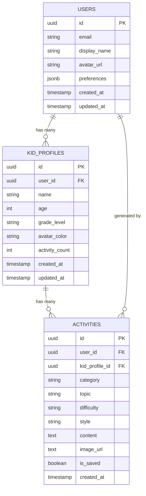

# Kidivity — Data Model & Supabase Schema

## Overview

All data is stored in Supabase PostgreSQL. Local state is managed by Zustand with AsyncStorage persistence for offline access. The app syncs local state with Supabase when connectivity is available.

---

## Entity Relationship Diagram



---

## Table Definitions

### `users`
Extends Supabase Auth's `auth.users`. Stores app-specific profile data.

```sql
CREATE TABLE public.users (
    id UUID PRIMARY KEY REFERENCES auth.users(id) ON DELETE CASCADE,
    email TEXT NOT NULL,
    display_name TEXT,
    avatar_url TEXT,
    preferences JSONB DEFAULT '{
        "default_style": "colorful",
        "default_difficulty": "medium"
    }'::jsonb,
    created_at TIMESTAMPTZ DEFAULT now(),
    updated_at TIMESTAMPTZ DEFAULT now()
);

-- RLS: Users can only read/write their own row
ALTER TABLE public.users ENABLE ROW LEVEL SECURITY;

CREATE POLICY "Users can view own profile"
    ON public.users FOR SELECT
    USING (auth.uid() = id);

CREATE POLICY "Users can update own profile"
    ON public.users FOR UPDATE
    USING (auth.uid() = id);
```

### `kid_profiles`
Each parent can have multiple kid profiles.

```sql
CREATE TABLE public.kid_profiles (
    id UUID PRIMARY KEY DEFAULT gen_random_uuid(),
    user_id UUID NOT NULL REFERENCES public.users(id) ON DELETE CASCADE,
    name TEXT NOT NULL,
    age INTEGER NOT NULL CHECK (age >= 1 AND age <= 18),
    grade_level TEXT NOT NULL,
    avatar_color TEXT DEFAULT '#6C63FF',
    activity_count INTEGER DEFAULT 0,
    created_at TIMESTAMPTZ DEFAULT now(),
    updated_at TIMESTAMPTZ DEFAULT now()
);

-- RLS: Users can only access their own kids' profiles
ALTER TABLE public.kid_profiles ENABLE ROW LEVEL SECURITY;

CREATE POLICY "Users can CRUD own kid profiles"
    ON public.kid_profiles FOR ALL
    USING (auth.uid() = user_id);

-- Index for fast lookup
CREATE INDEX idx_kid_profiles_user_id ON public.kid_profiles(user_id);
```

### `activities`
Generated activities with AI content.

```sql
CREATE TABLE public.activities (
    id UUID PRIMARY KEY DEFAULT gen_random_uuid(),
    user_id UUID NOT NULL REFERENCES public.users(id) ON DELETE CASCADE,
    kid_profile_id UUID NOT NULL REFERENCES public.kid_profiles(id) ON DELETE CASCADE,
    category TEXT NOT NULL CHECK (category IN ('puzzles', 'tracing', 'science', 'art', 'math', 'reading')),
    topic TEXT NOT NULL,
    difficulty TEXT NOT NULL DEFAULT 'medium' CHECK (difficulty IN ('easy', 'medium', 'hard')),
    style TEXT NOT NULL DEFAULT 'colorful' CHECK (style IN ('bw', 'colorful')),
    content TEXT NOT NULL,
    image_url TEXT,
    is_saved BOOLEAN DEFAULT false,
    created_at TIMESTAMPTZ DEFAULT now()
);

-- RLS
ALTER TABLE public.activities ENABLE ROW LEVEL SECURITY;

CREATE POLICY "Users can CRUD own activities"
    ON public.activities FOR ALL
    USING (auth.uid() = user_id);

-- Indexes
CREATE INDEX idx_activities_user_id ON public.activities(user_id);
CREATE INDEX idx_activities_kid_profile_id ON public.activities(kid_profile_id);
CREATE INDEX idx_activities_is_saved ON public.activities(is_saved) WHERE is_saved = true;
```

---

## Grade Level Enum Values

```typescript
export const GRADE_LEVELS = [
  'Pre-K',
  'Kindergarten',
  '1st Grade',
  '2nd Grade',
  '3rd Grade',
  '4th Grade',
  '5th Grade',
  '6th Grade',
  '7th Grade',
  '8th Grade',
  '9th Grade',
  '10th Grade',
  '11th Grade',
  '12th Grade',
] as const;
```

---

## Zustand Store Shapes (Local State)

### Profile Store
```typescript
interface ProfileStore {
  profiles: KidProfile[];
  activeProfileId: string | null;
  setActiveProfile: (id: string) => void;
  addProfile: (profile: KidProfile) => void;
  updateProfile: (id: string, updates: Partial<KidProfile>) => void;
  deleteProfile: (id: string) => void;
}
```

### Activity Store
```typescript
interface ActivityStore {
  recentActivities: Activity[];
  savedActivities: Activity[];
  isGenerating: boolean;
  generateActivity: (params: GenerateParams) => Promise<Activity>;
  toggleSaved: (id: string) => void;
}
```

### Auth Store
```typescript
interface AuthStore {
  user: User | null;
  session: Session | null;
  isLoading: boolean;
  signIn: (email: string, password: string) => Promise<void>;
  signUp: (email: string, password: string) => Promise<void>;
  signOut: () => Promise<void>;
}
```
