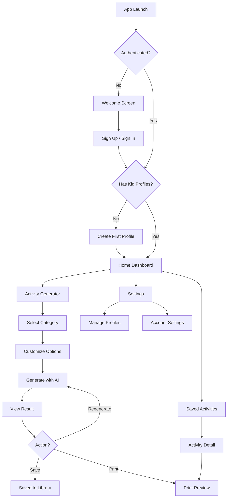

# Kaivity — Screen Flow & Navigation Map

## Navigation Architecture

```
Root (Stack Navigator)
├── (auth)                          ← Auth group (unauthenticated)
│   ├── welcome.tsx                 ← Landing / sign-in page
│   └── sign-up.tsx                 ← Registration page
│
├── (onboarding)                    ← First-time setup (authenticated, no profiles)
│   └── create-profile.tsx          ← Create first kid profile
│
├── (tabs)                          ← Main app (authenticated, has profiles)
│   ├── index.tsx                   ← Home / Dashboard
│   ├── generate.tsx                ← Activity Generator
│   ├── saved.tsx                   ← Saved Activities
│   └── settings.tsx                ← Settings & Profiles
│
├── activity/[id].tsx               ← Activity Detail (modal)
├── profile/create.tsx              ← Add New Kid Profile (modal)
├── profile/[id]/edit.tsx           ← Edit Kid Profile (modal)
└── print-preview.tsx               ← Print Preview (modal)
```

---

## Screen-by-Screen Specification

### 1. Welcome Screen — `(auth)/welcome.tsx`
**Purpose:** First impression. Convince parents to sign up.

| Element | Description |
|---|---|
| Hero illustration | AI-generated kid activity images |
| Tagline | "AI-Powered Activities Your Kids Will Love" |
| CTA buttons | "Get Started" → sign-up, "I have an account" → sign-in |
| Social auth | Google, Apple sign-in buttons |

**Navigation:** → Sign Up or → Home (if already authenticated)

---

### 2. Create Profile — `(onboarding)/create-profile.tsx`
**Purpose:** Onboard by creating the first kid profile.

| Element | Description |
|---|---|
| Name input | Text field |
| Age picker | Scroll wheel or counter (2-18) |
| Grade selector | Dropdown: Pre-K through 12th |
| Topic chips | Category-based topic suggestions |
| Avatar color | Color circle picker |
| Save button | Creates profile → navigates to Home |

**Navigation:** → Home (tabs)

---

### 3. Home / Dashboard — `(tabs)/index.tsx`
**Purpose:** Primary hub. Show active kid, recent activities, quick-generate button.

| Element | Description |
|---|---|
| Kid profile switcher | Horizontal scroll of kid avatars at top |
| "Generate Activity" FAB | Large floating action button |
| Recent activities | Vertical list of last 5 generated activities |
| Quick stats | "12 activities this week" etc. |
| Empty state | Friendly illustration + "Generate your first activity!" CTA |

**Navigation:** Tap activity → Activity Detail, FAB → Generator, Kid avatar → Profile edit

---

### 4. Activity Generator — `(tabs)/generate.tsx`
**Purpose:** Core feature. Select category, customize, generate.

**Step 1: Select Category**
| Element | Description |
|---|---|
| Category cards | 4 large tappable cards (Logic, Tracing, Educational, Screen-Free) with icons |
| Active kid indicator | Shows which kid profile is selected |

**Step 2: Customize**
| Element | Description |
|---|---|
| Topic input | "What topic?" — pre-filled from category defaults, editable |
| Difficulty | Easy / Medium / Hard slider |
| Style toggle | B&W (printer) vs Colorful |
| Generate button | Calls AI, shows loading animation |

**Step 3: Result**
| Element | Description |
|---|---|
| Activity preview | Rendered activity content |
| Action buttons | Save, Print, Regenerate, Share |

**Navigation:** Result → Activity Detail, Print → Print Preview

---

### 5. Saved Activities — `(tabs)/saved.tsx`
**Purpose:** Library of bookmarked/saved activities.

| Element | Description |
|---|---|
| Filter chips | By category, by kid, by date |
| Activity list | Cards with title, category, kid name, date |
| Empty state | "No saved activities yet" |

**Navigation:** Tap activity → Activity Detail

---

### 6. Settings — `(tabs)/settings.tsx`
**Purpose:** Manage profiles, account, and preferences.

| Section | Contents |
|---|---|
| Kid Profiles | List of profiles with edit/delete, "Add Profile" button |
| Account | Email, sign out |
| Preferences | Default style (B&W/Color), default difficulty |
| About | Version, feedback link, terms |

**Navigation:** Edit profile → Profile Edit modal, Add → Profile Create modal

---

### 7. Activity Detail — `activity/[id].tsx`
**Purpose:** Full-screen view of a single activity.

| Element | Description |
|---|---|
| Activity content | Full rendered text + images |
| Metadata | Category, kid name, date generated |
| Actions | Print, Save/Unsave, Regenerate, Share |

---

### 8. Print Preview — `print-preview.tsx`
**Purpose:** Show print-ready version before sending to printer.

| Element | Description |
|---|---|
| Print layout | Activity formatted for A4/Letter paper |
| Header | Kid's name, date |
| Print button | Opens native print dialog via `expo-print` |
| Share as PDF | Saves PDF via `expo-sharing` |

---

## User Flow Diagram


